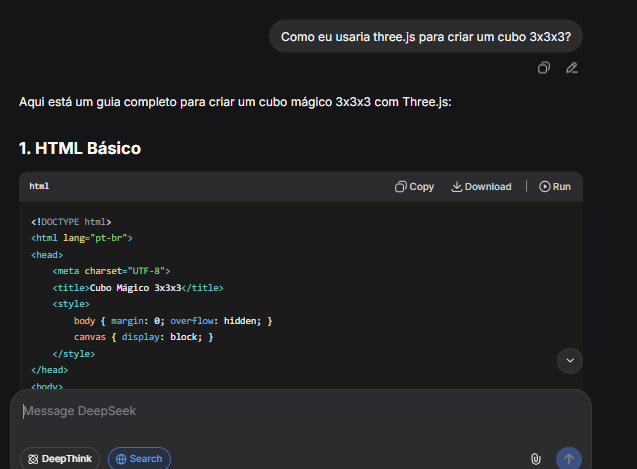

## Consultas IA:

###  // usado como base

### 

### 

###  

Não estava conseguindo mover aqui (era de -1,0 e 1, mas eu fui de 1 a 3):

        case 'Q': rotateFace(c => Math.round(c.position.y) === 1, new THREE.Vector3(0, 1, 0), -inv); 
            break;
        case 'E': rotateFace(c => Math.round(c.position.z) === 1, new THREE.Vector3(0, 0, 1), -inv); 
            break;

        case 'A': rotateFace(c => Math.round(c.position.y) === 2, new THREE.Vector3(0, 1, 0), -inv); 
            break;
        case 'D': rotateFace(c => Math.round(c.position.z) === 2, new THREE.Vector3(0, 0, 1), -inv); 
            break;
        
        case 'Z': rotateFace(c => Math.round(c.position.y) === 3, new THREE.Vector3(0, 1, 0), -inv); 
            break;
        case 'C': rotateFace(c => Math.round(c.position.z) === 3, new THREE.Vector3(0, 0, 1), -inv); 
            break;
    

### 

### 

### 

que gerou:

    const MOVES = {
        W: { sel: c => Math.round(c.position.y) ===  1, axis: 'y', dir:  1 },  // W = cima
        S: { sel: c => Math.round(c.position.y) === -1, axis: 'y', dir: -1 },  // S = baixo
        F: { sel: c => Math.round(c.position.z) ===  1, axis: 'z', dir:  1 },  // F = frente
        T: { sel: c => Math.round(c.position.z) === -1, axis: 'z', dir: -1 },  // T = trás
        D: { sel: c => Math.round(c.position.x) ===  1, axis: 'x', dir: -1 },  // D = direita
        E: { sel: c => Math.round(c.position.x) === -1, axis: 'x', dir:  1 },  // E = esquerda
    };

## IA: DEEPSEEK